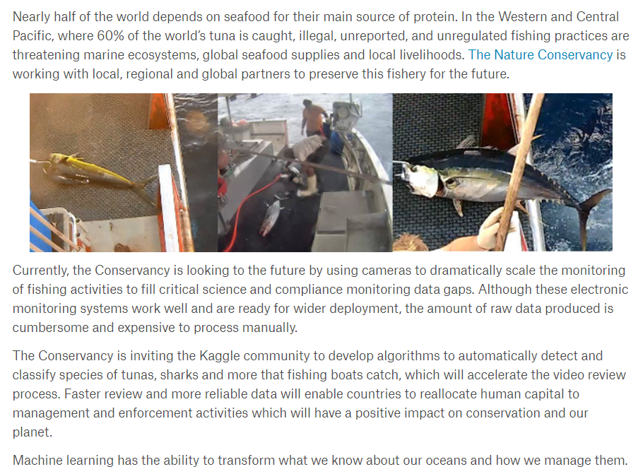

## Project Overview

- Detected and classified species of fish from a dataset of camera images taken on the fishing vessels
-	Designed a multi-stage pipeline that deployed baseline models including Naive Bayes, SVM & KNN, CNN models implemented from scratch, pre-trained CNN models using transfer learning technique and Multi-layer perceptron model. These models were compared and their performances were analyzed.

Please have a look at the KaggleFishClassification.pdf document for a detailed insight into the project.
